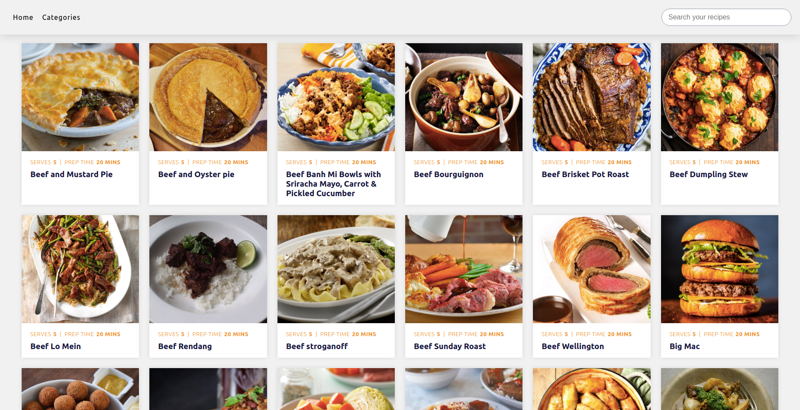

# Recipe-Catalogue


## Description

Recipe Catalogue is a React & Redux web app based on a catalog of recipes. It contains a browsable list of meals that you can filter by category or type and access to one meal recipe. The data is retrieved from [Meals DB (https://www.themealdb.com/api.php) and then stored in the Redux store.


## Library Directory 📙

| Contents                    |
| --------------------------- |

| [Live Demo](#live-demo)     |
| [Screenshot](#screenshot)   |
| [Built With](#built-with-🛠) |
| [Getting Started](#getting-started-🛠) |
| [Contributing](#contributing🛠) |
| [Authors](#authors)         |
| [License](#license)         |

## Live Demo

[Recipe-Catalogue](https://recipecatalogue.netlify.app/)

 ## Screenshot



## Built With 🛠

```
- JavaScript
- React
- Redux
- JSX
- CSS
```

## Getting Started

- Clone the repo `https://github.com/udberg/Recipe-Catalogue.git`
- cd `into` the project
- Run `git pull origin app`
- Run `yarn install` or `npm install` to install dependencies
- On the terminal run `npm run start` open up the live server
- To run tests write `npm run test` on the terminal

## Contributing

- Fork the project
- Create your feature branch `git checkout -b awesome-feature`
- Commit your changes `git commit -m 'Awesome feature'`
- Push it `git push -u origin awesome-feature`
- Open a pull request using this branch

## Authors

### 👨‍💻 Uduak John

[](https://github.com/udberg) <br>
[](https://www.linkedin.com/in/juduak/) <br>
[](mailto:udberg@icloud.com) <br>
[](https://twitter.com/juduak_)

### 🤝 Contributing

Contributions, issues and feature requests are welcome!

Feel free to check the [issues page](https://github.com/udberg/Magic-Books).

### Show your support

Give a ⭐️ if you like this project!

### License


